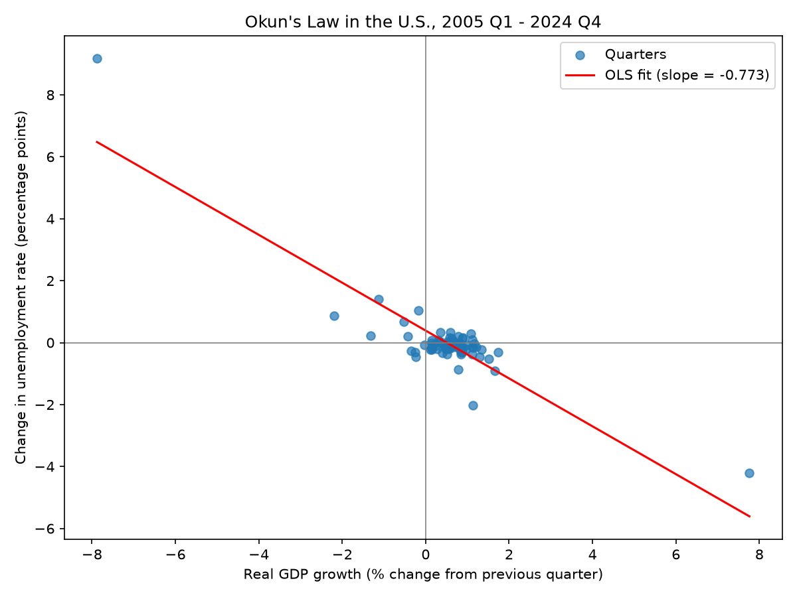

# ECON 611 Project Results: Does Okun's Law Still Hold in the U.S.?

## Data

I used two FRED series: **UNRATE** (the U.S. unemployment rate, monthly) and **GDPC1** (U.S. real GDP, quarterly). I fetched data from January 2004 through December 2024, so the 2004 data could be used to calculate the changes for 2005 Q1. The analysis covers **2005 Q1 through 2024 Q4, which is 80 quarters**.

## Method

1. I averaged the three monthly unemployment rates in each quarter to get a quarterly unemployment rate.
2. I calculated **GDP growth** as the percent change in real GDP from the previous quarter. It is not annualized.
3. I calculated the **change in unemployment** as this quarter's unemployment rate minus last quarter's, in percentage points.
4. I made a scatter plot (`okun_scatter.png`) and ran a simple OLS regression:

   change in unemployment = a + b × GDP growth

5. As a robustness check, I ran the same regression again without 2020 Q2 and 2020 Q3, the two COVID quarters.

## Results

| Sample | Slope (b) | Std. error | p-value | R-squared | Quarters |
|---|---|---|---|---|---|
| Full sample | −0.773 | 0.044 | p < 0.001 | 0.795 | 80 |
| Without 2020 Q2 and Q3 | −0.349 | 0.063 | p < 0.001 | 0.289 | 78 |

**What the slope means:** The slope is in *percentage points of unemployment per percentage point of quarterly GDP growth*. In the full sample, a quarter with GDP growth 1 percentage point higher (for example 1.5% instead of 0.5%) is associated with an unemployment rate that falls by about **0.77 percentage points** more that quarter. Without the COVID quarters, the same 1-point difference is associated with about **0.35 percentage points** more of a drop. Because growth is measured per quarter, 1 percentage point of quarterly growth is a large difference, roughly 4 points at an annual rate.

**Effect of excluding 2020 Q2 and Q3:** These two quarters are extreme. GDP fell sharply and unemployment jumped in Q2, then both reversed in Q3. They sit far from the other points and pull the fitted line steeply. Removing them:
- **Cuts the slope by more than half**, from −0.77 to −0.35.
- **Lowers R-squared from 0.80 to 0.29.** So most of the full sample's tight fit comes from those two quarters. Without those two quarters, GDP growth explains about 29% of the variation in unemployment changes.
- **Leaves the slope negative and statistically significant** (p < 0.001).

The −0.349 estimate is the result excluding 2020 Q2 and Q3. The relationship remains negative when those two quarters are left out.

## Conclusion

The results **support my expectation and suggest Okun's Law still holds** in the U.S. from 2005 to 2024. In both regressions, faster GDP growth goes with falling unemployment, and the relationship is statistically significant.

**Association, not causation:** This regression shows that GDP growth and unemployment changes move together. It does not prove that GDP growth *causes* unemployment to fall. Causality could run both ways, since more people working also produces more output. Other factors, such as the business cycle, Federal Reserve policy, or shocks like COVID, can move both at once.

**Limitations:** This is a simple one-variable regression with standard (non-robust) standard errors. The p-values could be somewhat too small if the errors are correlated over time, and the Durbin-Watson statistic of 1.32 in the no-COVID regression hints at this. Statistical significance is based on conventional OLS standard errors; robustness to serial correlation has not been tested.
